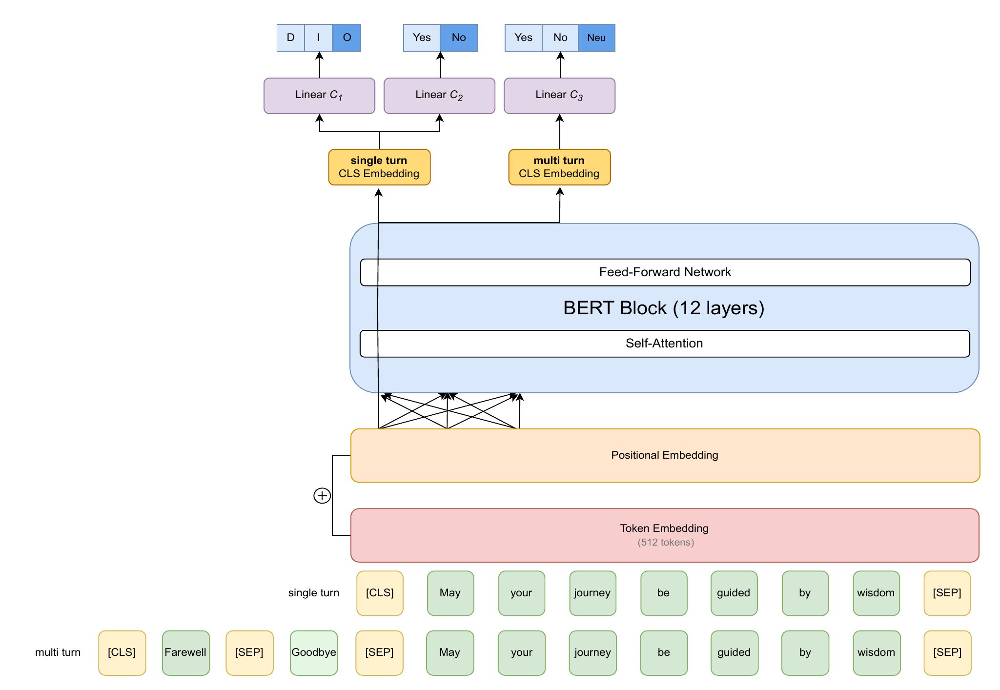

## About This Application

This application is a follow-up work on my master thesis at the UCLouvain:
**"Automatic Evaluation of the Pedagogical Effectiveness of Open-Domain Chatbots in a Language Learning Game"**
The repository can be found [here](https://github.com/C-bianc/ChatEvaluationDemo).

### Key Features:
- Uses a **unified model** to evaluate user input and generate responses
- Computes **SEED** (scoring educational effectiveness of dialogue) metric to evaluate conversational effectiveness
- Adapts accordingly

### Technical Details:
- The SEED metric evaluates bot responses based on intent, output elicitation, and helpfulness labels from our evaluator
- The unified model is a multi-head BERT for sequence classification
- We implemented SEED, but also adaptive rules triggered by our evaluations to refine bot responses

___

## About Evaluator Model

### Benchmarking Results

Our research benchmarked several transformer-based models. The BERT model achieved the highest overall performance, outperforming all other architectures across the three evaluation dimensions:

| **Model** | **Intent (F1)** | **Output (F1)** | **Support (F1)** | **Overall (F1)** |
|-----------|----------------|-----------------|-------------------|------------------|
| BERT      | **0.839**      | **0.977**       | **0.815**         | **0.877**        |
| RoBERTa   | 0.807          | 0.961           | 0.810             | 0.860            |
| DistilBERT| 0.791          | 0.962           | 0.801             | 0.851            |
| mBERT     | 0.790          | 0.966           | 0.781             | 0.846            |
| DistilmBERT| 0.784         | 0.964           | 0.778             | 0.842            |

BERT stood out particularly on the Interactional Support dimension, where it achieved the highest F1 score and was the only model to exceed 80% recall. While RoBERTa ranked second overall, it showed greater variation across tasks.

The distilled models performed well on Output Elicitation, where all architectures scored highly across metrics with only minor differences. Performance on Communicative Intent and Interactional Support varied more, especially in recall.

## Unified Model Architecture

Bianca Ciobanica, 2025